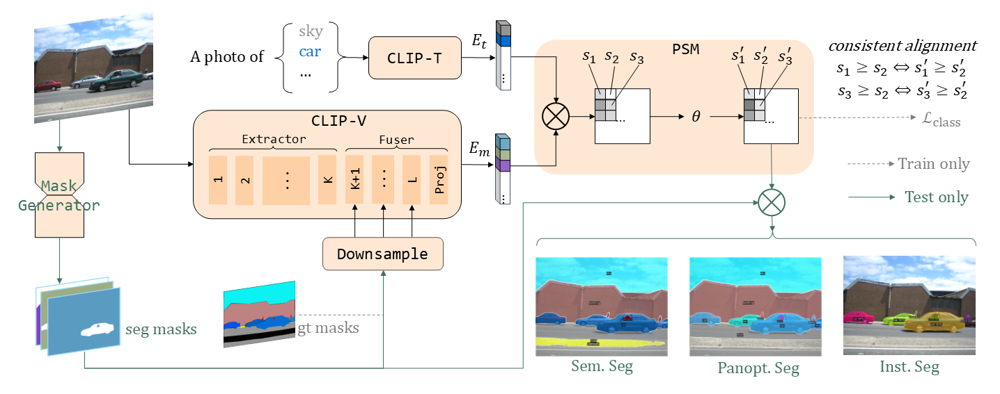

# MaskCLIP++: High-Quality Mask Tuning Matters for Open-Vocabulary Segmentation

[](https://paperswithcode.com/sota/open-vocabulary-semantic-segmentation-on-2?p=maskclip-a-mask-based-clip-fine-tuning)
[](https://paperswithcode.com/sota/open-vocabulary-semantic-segmentation-on-3?p=maskclip-a-mask-based-clip-fine-tuning)
[](https://paperswithcode.com/sota/open-vocabulary-semantic-segmentation-on-7?p=maskclip-a-mask-based-clip-fine-tuning)
[](https://paperswithcode.com/sota/open-vocabulary-semantic-segmentation-on-1?p=maskclip-a-mask-based-clip-fine-tuning)
[](https://paperswithcode.com/sota/open-vocabulary-semantic-segmentation-on-5?p=maskclip-a-mask-based-clip-fine-tuning)

## News
- [x] (2025.03.13) Paper has been revised.
- [x] (2025.01.03) Add [demo](demo/README.md).

## Introduction

This repo contains the code for our [paper](https://arxiv.org/abs/2412.11464).

**Abstract:** Open-vocabulary image segmentation has been advanced through the synergy between mask generators and vision-language models like Contrastive Language-Image Pre-training (CLIP). Previous approaches focus on generating masks while aligning mask features with text embeddings during training. In this paper, we observe that relying on generated low-quality masks can weaken the alignment of vision and language in regional representations. This motivates us to present a new fine-tuning framework, named MaskCLIP++, which uses ground-truth masks instead of generated masks to enhance the mask classification capability of CLIP. Due to the limited diversity of image segmentation datasets with mask annotations, we propose incorporating a consistency alignment principle during fine-tuning, which alleviates categorical bias toward the fine-tuning dataset. After low-cost fine-tuning, MaskCLIP++ significantly improves the mask classification performance on multi-domain datasets. Combining with the mask generator in previous state-of-the-art mask-based open vocabulary segmentation methods, we achieve performance improvements of +1.7, +2.3, +2.1, +3.1, and +0.3 mIoU on the A-847, PC-459, A-150, PC-59, and PAS-20 datasets, respectively.

<div style="display: flex; justify-content: center; align-items: center; flex-direction: column; text-align: center; position: relative;">
  
  <div style="font-size: 12px; color: gray; margin-top: 10px;">Simplified framework for MaskCLIP++</div>
</div>


## Installation

See [installation instructions](INSTALL.md).

## Preparations

### Datasets

See [Preparing Datasets for MaskCLIP++](datasets/README.md).

### Pretrained CLIP models

The pre-trained CLIP can be downloaded **automatically** from huggingface.


### Mask generators

All models can be **automatically** downloaded during runtime. If there are network issues in the runtime environment, you can expand the following table and download the models in the `url` column to the `path` location.

<details>
<summary>Unfold</summary>

| name | weights |  path |
|:----:|:-------:|:-----:|
| Mask2Former (Swin-T) | [url](https://dl.fbaipublicfiles.com/maskformer/mask2former/coco/panoptic/maskformer2_swin_tiny_bs16_50ep/model_final_9fd0ae.pkl) | `output/ckpts/mask2former/coco/pan/maskformer2_swin_tiny_bs16_50ep_final_9fd0ae.pkl` |
| Mask2Former (Swin-L) | [url](https://dl.fbaipublicfiles.com/maskformer/mask2former/coco/panoptic/maskformer2_swin_large_IN21k_384_bs16_100ep/model_final_f07440.pkl) | `output/ckpts/mask2former/coco/pan/maskformer2_swin_large_IN21k_384_bs16_100ep_final_f07440.pkl` |
| FC-CLIP (ConvNext-B) | [url](https://drive.google.com/uc?id=1fSFPPTwxF-ekMxAmIo01ssdbC79wwwml)(*) | `output/ckpts/fcclip/fcclip_coco-pan_clip-convnext-base.pth`  |
| FC-CLIP (ConvNeXt-L) | [url](https://drive.google.com/uc?id=1-91PIns86vyNaL3CzMmDD39zKGnPMtvj) | `output/ckpts/fcclip/fcclip_coco-pan_clip-convnext-large.pth` |
| MAFTP-B              | [url](https://drive.google.com/uc?id=1BeEeKOnWWIWIH-QWK_zLhAPUzCOnHuFG) | `output/ckpts/maftp/maftp_b.pth` |
| MAFTP-L              | [url](https://drive.google.com/uc?id=1EQo5guVuKkSSZj4bv0FQN_4X9h_Rwfe5) | `output/ckpts/maftp/maftp_l.pth` |
| MAFTP-L-PANO         | [url](https://drive.google.com/uc?id=1znk_uco8fwvbA0kndy4kGyVp22KbQr6g) | `output/ckpts/maftp/maftp_l_pano.pth` |

> Except for the asterisk-marked(*) url, all the other urls are from the original repository

</details>

### MaskCLIP++ models

Our model can be combined with the previous mask generator to achieve better open-vocabulary image segmentation performance. The following checkpoint should be **manually** downloaded to a local path.

Our best checkpoint: [EVA02 CLIP-L-14, finetuned both CLIP-V and CLIP-T, on COCO Stuff](https://drive.google.com/file/d/1I5SiU5S-BjgoGU73ndocg-e2jo80mP1n/view?usp=drive_link)

#### (i) Sem. Seg

| Config | A-847 | PC-459 | A-150 | PC-59 | PAS-20 |
|:---:|:---:|:---:|:---:|:---:|:---:|
| FC-CLIP | 14.8 | 18.2 | 34.1 | 58.4 | 95.4 |
| [Ours + FC-CLIP](configs/coco-stuff/eva-clip-vit-l-14-336/fcclip-l/maskclippp_coco-stuff_eva-clip-vit-l-14-336_wtext_fcclip-l_ens.yaml) | 15.4 | 21.3 | 37.1 | 62.6 | 96.4 |
| MAFTP   | 15.1 | 21.6 | 36.1 | 59.4 | 96.5 |
| [Ours + MAFTP](configs/coco-stuff/eva-clip-vit-l-14-336/maft-l/maskclippp_coco-stuff_eva-clip-vit-l-14-336_wtext_maft-l_ens.yaml)   | 16.8 | 23.9 | 38.2 | 62.5 | 96.8 |

#### (ii) Panopt. Seg and Inst. Seg

| Config | PQ | SQ | RQ | AP |
|:---:|:---:|:---:|:---:|:---:|
| FC-CLIP | 26.8 | 71.5 | 32.2 | 16.8 |
| [Ours + FC-CLIP](configs/coco-stuff/eva-clip-vit-l-14-336/fcclip-l/maskclippp_coco-stuff_eva-clip-vit-l-14-336_wtext_fcclip-l_ens.yaml) | 27.7 | 72.0 | 33.6 | 17.3 |
| MAFTP | 27.1 | 73.5 | 32.9 | - |
| [Ours + MAFTP](configs/coco-stuff/eva-clip-vit-l-14-336/maft-l-pan/maskclippp_coco-stuff_eva-clip-vit-l-14-336_wtext_maft-l-pan_ens.yaml) | 28.1 | 74.0 | 34.7 | - |


<details>
<summary>Other models</summary>

>  Finetuned CLIP-V, on COCO-Stuff, Use mask generators from MAFTP.

| config | ckpt | A-847 | PC-459 | A-150 | PC-59 | PAS-20 |
|:------:|:------:|:------:|:------:|:------:|:------:|:------:|
| [clip-convnext-base](configs/coco-stuff/clip-convnext-base/maft-b/maskclippp_coco-stuff_clip-convnext-base_maft-b_ens.yaml) | [url](https://drive.google.com/file/d/1SekxdQPCMXLaAd8mM0P20DbHKhtIYL3u/view?usp=drive_link) | 14.5 | 18.7 | 35.4 | 59.1 | 95.8 |


>  Finetuned CLIP-V, on COCO-Panoptic, Use mask generators from FC-CLIP. Eval on ADE20K.

| config | ckpt | mIoU | PQ | AP |
|:---:|:---:|:---:|:---:|:---:|
| [clip-rn50x16](configs/coco-pan/clip-rn50x16/fcclip-b/maskclippp_coco-pan_clip-rn50x16_fcclip-b.yaml) | [url](https://drive.google.com/file/d/1eCxFDGNATeB1pqmRnEO6OD8GZG-Wf4Hs/view?usp=drive_link) |  29.3 | 21.8 | 11.1 |
| [clip-convnext-base](configs/coco-pan/clip-convnext-base/fcclip-b/maskclippp_coco-pan_clip-convnext-base_fcclip-b.yaml)  | [url](https://drive.google.com/file/d/1lxlnxVICytERs1FsY5N7LdaoYDyenA1o/view?usp=drive_link) | 35.1 | 24.5 | 13.6 |
| [clip-convnext-large](configs/coco-pan/clip-convnext-large/fcclip-l/maskclippp_coco-pan_clip-convnext-large_fcclip-l.yaml) | [url](https://drive.google.com/file/d/1XMW3L2dOtlDQapydtoqTfzFVW-VZqcoX/view?usp=drive_link) | 35.6 | 26.5 | 16.7 |
| [clip-convnext-xxlarge](configs/coco-pan/clip-convnext-xxlarge/fcclip-l/maskclippp_coco-pan_clip-convnext-xxlarge_fcclip-l.yaml) | [url](https://drive.google.com/file/d/1LjVW7CNkvyFzxOW4rbgax1kmWY1lQ3f3/view?usp=drive_link) | 36.4 | 27.1 | 16.6 | 
| [eva-clip-vit-b-16](configs/coco-pan/eva-clip-vit-b-16/fcclip-b/maskclippp_coco-pan_eva-clip-vit-b-16_fcclip-b.yaml) | [url](https://drive.google.com/file/d/11n8VRcfaTsb7s7I3i7dlvq3Jy4GSgDr2/view?usp=drive_link) | 33.8 | 24.4 | 13.2 |
| [eva-clip-vit-l-14-336](configs/coco-pan/eva-clip-vit-l-14-336/fcclip-l/maskclippp_coco-pan_eva-clip-vit-l-14-336_fcclip-l.yaml) | [url](https://drive.google.com/file/d/1xMlDmgiVuShx-KWzLzOB-0_qvawIAa9m/view?usp=drive_link) | 36.6 | 27.3 | 17.0 |
| [eva-clip-vit-g-14-plus](configs/coco-pan/eva-clip-vit-g-14-plus/fcclip-l/maskclippp_coco-pan_eva-clip-vit-g-14-plus_fcclip-l.yaml) | [url](https://drive.google.com/file/d/1hCj0eZdTKbt5DusULFGBk3Bk8bxUGGm-/view?usp=drive_link) | 36.8 | 27.7 | 17.1 |


</details>


## Usage

## Demo

[Use the demo of MaskCLIP++](demo/README.md).

### Evaluation

#### Mask Classification Evaluation

```bash
source eval_mask_acc.sh
eval_mask_acc_ade150 $config $ckpt $ngpu $tag 1
# $ngpu is an integer representing the number of GPUs in use.
# $tag is the name of a run.
# more options can be found in eval_mask_acc.sh
```


| Model | Script |  A-847 | PC-459 | A-150 | PC-59 | Stuff | Citys | General | Earth | Medical | Engineer | Agriculture |
|:---:|:---:|:---:|:---:|:---:|:---:|:---:|:---:|:---:|:---:|:---:|:---:|:---:|
| Origin CLIP | `eval_mask_acc_xxx $config "\"\"" $ngpu $tag 0` | 35.2 | 44.8 | 52.7 | 54.6 | 45.0 | 44.9 | 56.9 | 60.5 | 61.7 | 33.8 | 52.4 |
| MaskCLIP++ | `eval_mask_acc_xxx $config $ckpt $ngpu $tag 1` | 38.4 | 56.4 | 67.0 | 85.2 | 67.8 | 71.0 | 67.9 | 68.6 | 74.7 | 50.3 | 65.5 |


> Mask Accuracy is reported above.
> Use the [config](configs/coco-stuff/eva-clip-vit-l-14-336/maft-l/maskclippp_coco-stuff_eva-clip-vit-l-14-336_wtext_maft-l_ens.yaml) and [our best checkpoint](https://drive.google.com/file/d/1I5SiU5S-BjgoGU73ndocg-e2jo80mP1n/view?usp=drive_link).

#### OVS Evaluation

```bash
source eval_all.sh
eval_ade150 $config $ckpt $ngpu $tag
# $ngpu is an integer representing the number of GPUs in use.
# $tag is the name of a run.
# Other options include: eval_ade847, eval_ctx459, eval_ctx59, eval_pc20
```


### Fine-tuning

For base/large sized CLIPs, the fine-tuning requires about **2-4 hours on 2x NVIDIA 24G 3090 GPUs**.

```bash
python train_maskclippp.py \
    --config-file $config \
    --num-gpus $ngpu \
    --dist-url "auto" \
    --tag $tag \
    WANDB.ENABLED True
```

## Citing MaskCLIP++
```
@misc{zeng2025maskclippp,
      title={High-Quality Mask Tuning Matters for Open-Vocabulary Segmentation}, 
      author={Quan-Sheng Zeng and Yunheng Li and Daquan Zhou and Guanbin Li and Qibin Hou and Ming-Ming Cheng},
      year={2025},
      eprint={2412.11464},
      archivePrefix={arXiv},
      primaryClass={cs.CV},
      url={https://arxiv.org/abs/2412.11464}, 
}
```


## Acknowledgement

Thanks to the following open source code and models:

- [OpenCLIP](https://github.com/mlfoundations/open_clip)
- [EVA](https://github.com/baaivision/EVA)
- [Mask2Former](https://github.com/facebookresearch/Mask2Former)
- [FC-CLIP](https://github.com/bytedance/fc-clip)
- [MAFT+](https://github.com/jiaosiyu1999/MAFT-Plus)
