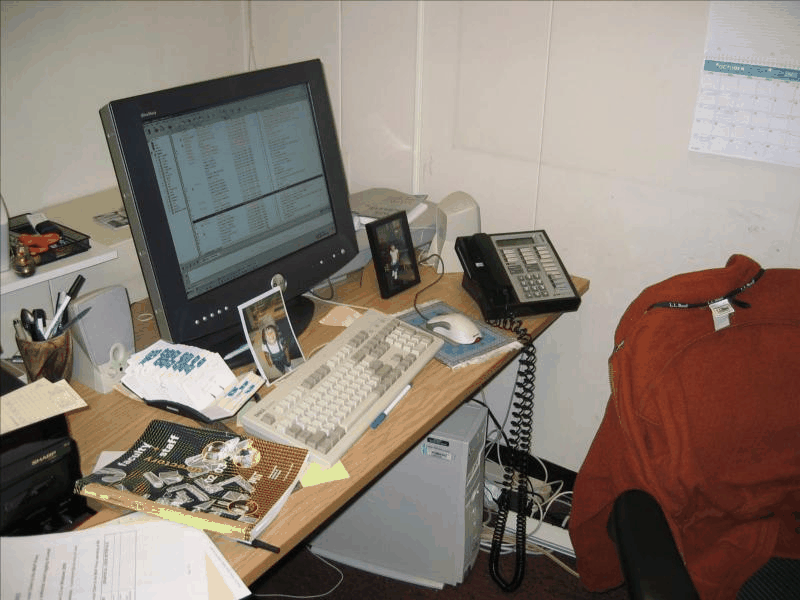
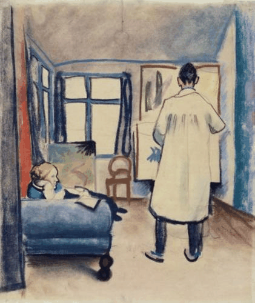
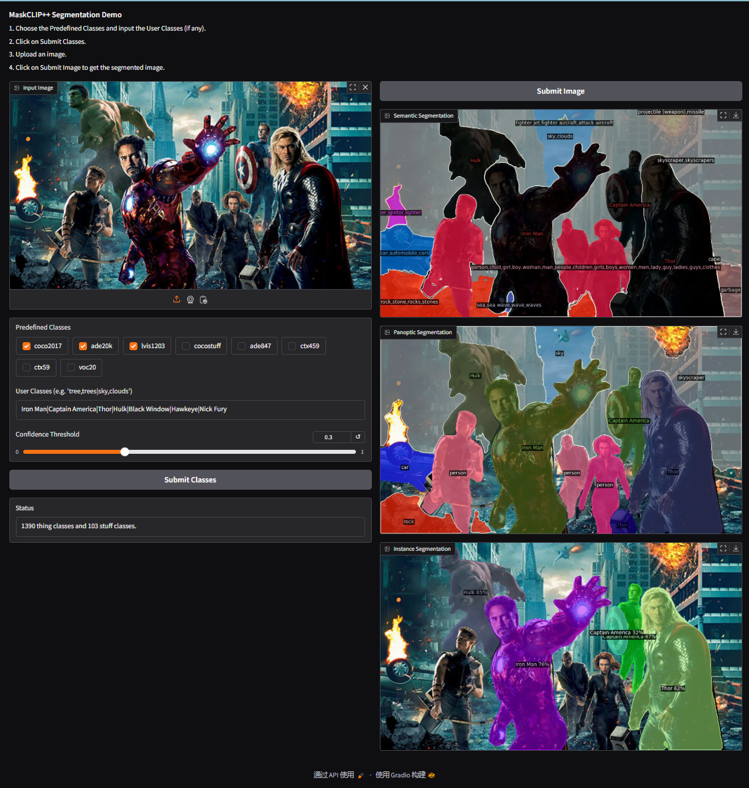

# Use the demo of MaskCLIP++

<!-- 

 -->

<p align="center">
  
</p>
<p align="center">
  
</p>
<p align="center">
  
</p>


We provide two forms of demo. A gradio based `demo/app.py` for processing individual images and adjusting vocabularies. One is `demo/demo.py`, which is used on the command line and is suitable for batch processing multiple pictures or videos. The instructions are as follows:


## Gradio Demo

1. Select the model and launch the application using the following command
2. Choose the `Predefined Classes` and input the `User Classes` (if any).
3. Click on `Submit Classes`.
4. Upload an image.
5. Click on `Submit Image` to get the segmented image.

```shell
# OVSS only
config="configs/coco-stuff/eva-clip-vit-l-14-336/maft-l/maskclippp_coco-stuff_eva-clip-vit-l-14-336_wtext_maft-l_ens.yaml"
ckpt="output/ckpts/maskclippp/maskclippp_coco-stuff_eva-clip-vit-l-14-336_wtext.pth"

# # OVSS/OVPS/OVIS
# config="configs/coco-stuff/eva-clip-vit-l-14-336/fcclip-l/maskclippp_coco-stuff_eva-clip-vit-l-14-336_wtext_fcclip-l_ens.yaml"


python demo/app.py \
    --config-file $config \
    --opts \
    MODEL.WEIGHTS $ckpt
```

<p align="center">
  
</p>


## Command Demo

Similar to the `demo/app.py` startup command, except that the input, output, and vocabularies need to be specified through the command line. For details please see:
```
python demo/demo.py -h
```

### Open-Vocabulary Semantic Segmentation

```shell
config="configs/coco-stuff/eva-clip-vit-l-14-336/fcclip-l/maskclippp_coco-stuff_eva-clip-vit-l-14-336_wtext_fcclip-l_ens.yaml"
ckpt="output/ckpts/maskclippp/maskclippp_coco-stuff_eva-clip-vit-l-14-336_wtext.pth"
python demo/demo.py \
    --config-file $config \
    --input /path/to/imgs \
    --output /path/to/output \
    --opts \
    MODEL.WEIGHTS $ckpt \
    MODEL.MASK_FORMER.TEST.PANOPTIC_ON False \
    MODEL.MASK_FORMER.TEST.INSTANCE_ON False \
    MODEL.MASK_FORMER.TEST.SEMANTIC_ON True
```

### Open-Vocabulary Panoptic Segmentation

**Note: Please use the mask generator trained on panoptic segmentation data**

```shell
config="configs/coco-stuff/eva-clip-vit-l-14-336/fcclip-l/maskclippp_coco-stuff_eva-clip-vit-l-14-336_wtext_fcclip-l_ens.yaml"
ckpt="output/ckpts/maskclippp/maskclippp_coco-stuff_eva-clip-vit-l-14-336_wtext.pth"
python demo/demo.py \
    --config-file $config \
    --input /path/to/imgs \
    --output /path/to/output \
    --opts \
    MODEL.WEIGHTS $ckpt \
    MODEL.MASK_FORMER.TEST.PANOPTIC_ON True \
    MODEL.MASK_FORMER.TEST.INSTANCE_ON False \
    MODEL.MASK_FORMER.TEST.SEMANTIC_ON False
```

### Open-Vocabulary Instance Segmentation

**Note: Please use the mask generator trained on panoptic/instance segmentation data**

```shell
config="configs/coco-stuff/eva-clip-vit-l-14-336/fcclip-l/maskclippp_coco-stuff_eva-clip-vit-l-14-336_wtext_fcclip-l_ens.yaml"
ckpt="output/ckpts/maskclippp/maskclippp_coco-stuff_eva-clip-vit-l-14-336_wtext.pth"
python demo/demo.py \
    --config-file $config \
    --input /path/to/imgs \
    --output /path/to/output \
    --confidence-threshold 0.3 \
    --opts \
    MODEL.WEIGHTS $ckpt \
    MODEL.MASK_FORMER.TEST.PANOPTIC_ON True \
    MODEL.MASK_FORMER.TEST.INSTANCE_ON True \
    MODEL.MASK_FORMER.TEST.SEMANTIC_ON False
```